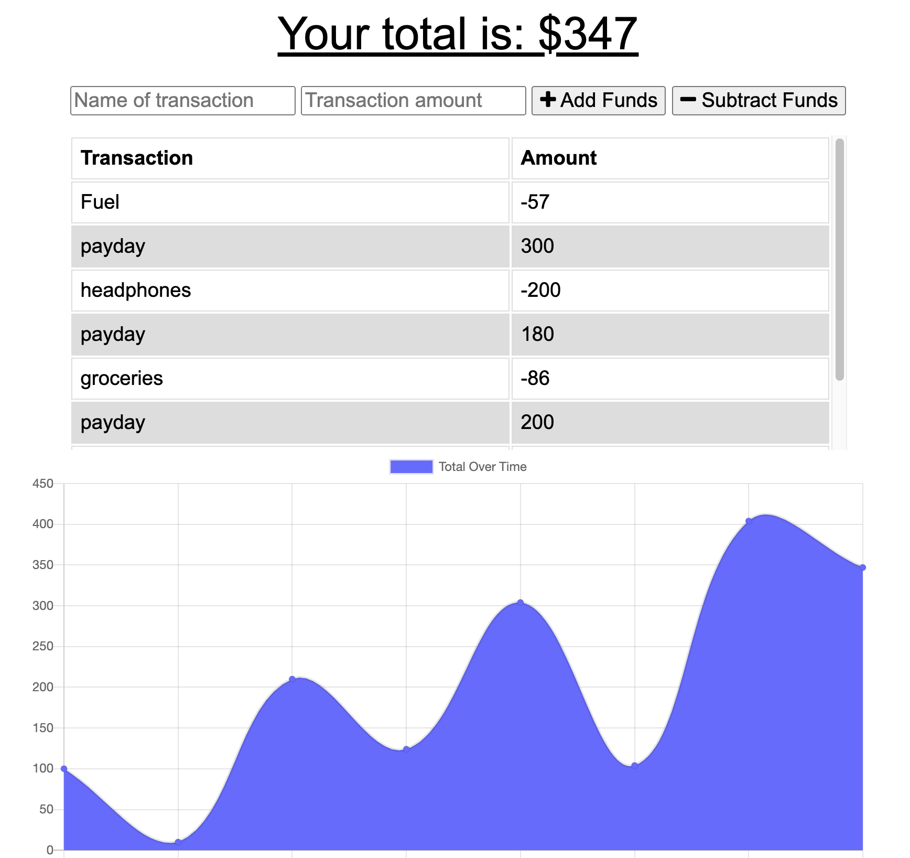

# Budget Tracker

This is a basic budget tracker that saves transactions to a Mongo database when online while providing a local database fallback using IndexedDB when offline. For entries saved to the local database, they are synced to the primary database when online again.

## Table of Contents

- [Site Link](#site-link)
- [License](#license)
- [Screenshots](#screenshots)
- [Contact](#contact)

## Site Link

You can view the app here: https://agile-anchorage-22042.herokuapp.com/

## License

Distributed under the MIT License. See `LICENSE` for more information.

## Screenshots

## Contact

Have a burning question about this project? You can reach me at the following:

RJ Wright - rj@rjwright.me
[![twitter][twitter-shield]][twitter-url][![LinkedIn][linkedin-shield]][linkedin-url]

[linkedin-shield]: https://img.shields.io/badge/-LinkedIn-black.svg?style=flat-square&logo=linkedin&colorB=1178B3
[linkedin-url]: https://www.linkedin.com/in/rjwrightme/
[twitter-shield]: https://img.shields.io/badge/-Twitter-black.svg?style=flat-square&logo=twitter&logoColor=FFF&colorB=2AA3EF
[twitter-url]: https://twitter.com/rjwrightme
